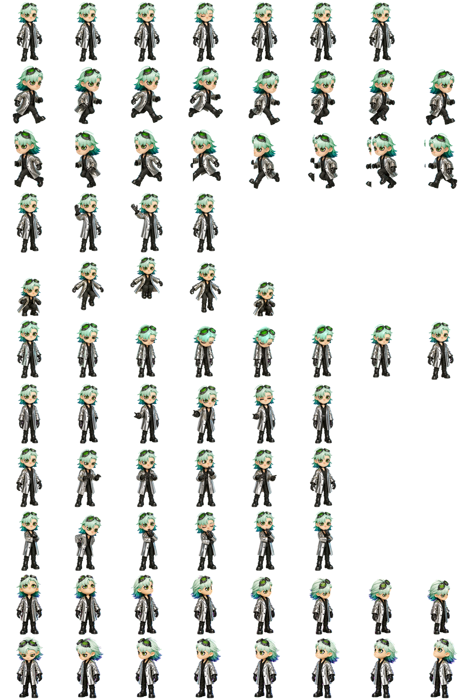

# Stella — a custom desktop pet

A little animated companion for your Codex desktop app. Stella has mint-green hair, goggles, and a silver coat, with different poses for working, waiting, and reacting.

<p align="center">
  
</p>

**[Download Stella](https://github.com/comet-ctrl/Codex-pet-stella/archive/refs/heads/main.zip)** · [Artwork credits](CREDITS.md)

## Install on Windows

1. **Download and unzip** the file above.
2. Open the extracted folder, then open **`package`**. Copy the **`stella-materialism`** folder.
3. Open File Explorer and paste **`%USERPROFILE%\.codex\pets`** into the address bar. If the `pets` folder does not exist, create it inside `%USERPROFILE%\.codex`. Paste the copied folder there.
4. Open your desktop app's **Pets** settings, refresh the list if available, and choose **Stella**. Restart the app if she does not appear.

No coding or terminal commands needed. Keep both files together:

```text
.codex/pets/stella-materialism/
├── pet.json
└── spritesheet.webp
```

Already have Stella installed? Back up the existing `stella-materialism` folder before replacing it.

## What does she look like?

The portrait above shows Stella's design. This sheet shows the actual animation frames and different look directions included in your download:

<p align="center">
  
</p>

## Compatibility

This package is for the desktop app's **V2 custom pets**. It was validated for Codex Desktop on Windows `26.727.51351`. The files have also been installed and checked on `26.924.2738.0`, but appearance and animation in that version still need manual verification. Menu names may vary by version.

This is not a standalone desktop app or a ChatGPT web pet upload. See [validation details](VALIDATION.md).

## Remove Stella

Choose another pet, then delete only the `stella-materialism` folder from `.codex/pets`. Restart the app if needed.

## Credits

Unofficial fan-made artwork inspired by Stella from Studio Wrong's *Stella's Materialism*. Not affiliated with or endorsed by Studio Wrong. [Artwork credits and source links →](CREDITS.md)
